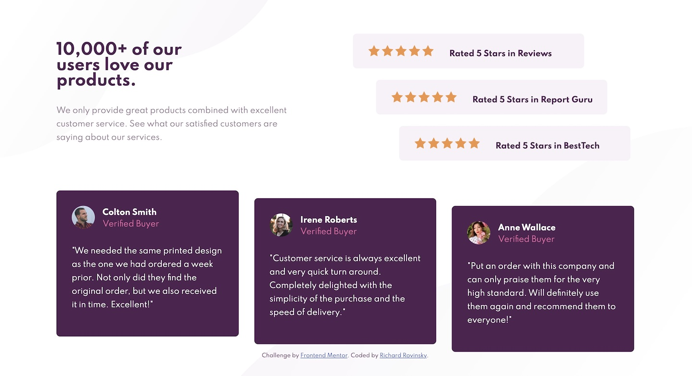

# Frontend Mentor - Social proof section solution

This is a solution to the [Social proof section challenge on Frontend Mentor](https://www.frontendmentor.io/challenges/social-proof-section-6e0qTv_bA). Frontend Mentor challenges help you improve your coding skills by building realistic projects. 

## Table of contents

- [Overview](#overview)
  - [The challenge](#the-challenge)
  - [Screenshot](#screenshot)
  - [Links](#links)
- [My process](#my-process)
  - [Built with](#built-with)
  - [What I learnt](#what-i-learnt)
  - [Continued development](#continued-development)
- [Author](#author)

## Overview

### The challenge

Users should be able to:

- View the optimal layout for the section depending on their device's screen size

### Screenshot

### Links

- Solution URL: [Solution](https://github.com/rikirovinsky/social-proof-section.git)
- Live Site URL: [Live Site](https://rikirovinsky.github.io/social-proof-section)

## My process

- There is not much to say. I started with finding the best solution for adjustable code to implement both mobile and desktop requierements. 
- I then played around with mixing grid and fles diplay. 

### Built with

- Semantic HTML5 markup
- CSS custom properties
- Flexbox
- CSS Grid
- Mobile-first workflow

### What I learnt

I have learnt how to target specific part of the code in order to give it a specific format. It was a great experience to find how to use ID and Class in order to use a more versatile and copyable code.

### Continued development

I would like to continue to focus on using CSS grid and flex in order to improve versatility of site, so that they work better both on mobile and desktop devices.

## Author

- Website - [Richard Rovinsky](https://github.com/rikirovinsky)
- Frontend Mentor - [@rikirovinsky](https://www.frontendmentor.io/profile/rikirovinsky)
